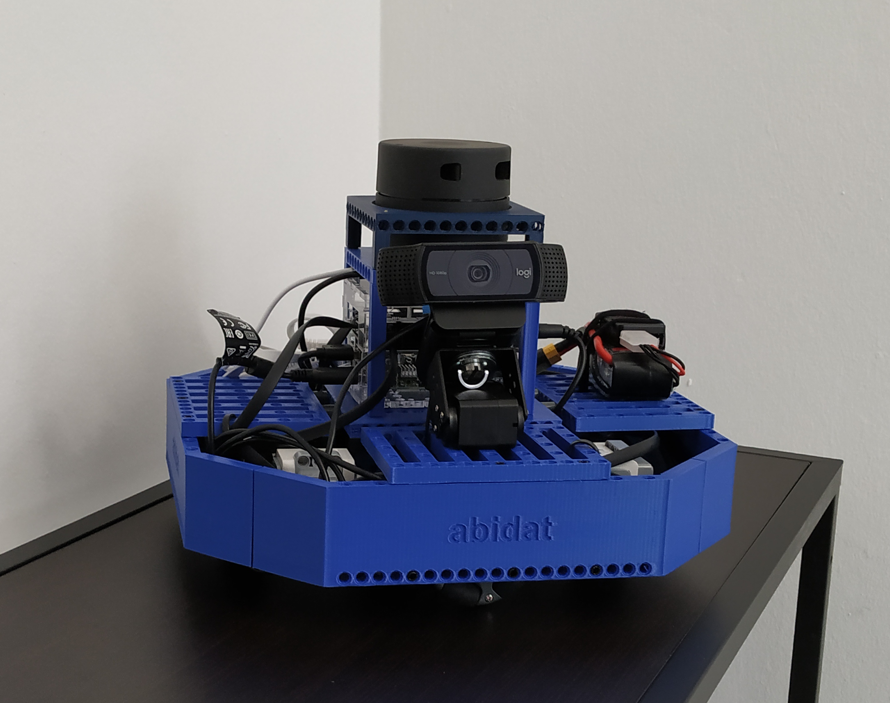
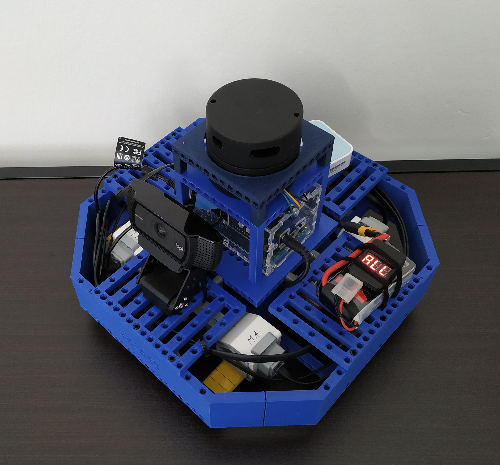

# General

Contains construction 3d parts for building robots that can be easily printed by an 3d printer.

# Robots

## Marvin

Marvin is a modular, omnidirectional robot platform. The core of this robot is a Raspberry Pi control unit with a [... Shield ] which controls the four LEGO EV3 Mindstorm motors. The housing of the platform consists of a combination of standard Lego components as well as additional 3D-printing modules, which were individually manufactured. With the 3D printed components, attention was paid to the fact that the typical Lego grid was kept and thus an easy expansion of the robot is guaranteed.

 